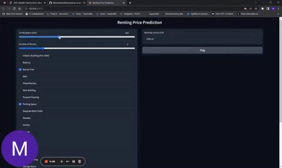

# Flat Price Assistant 

Accurate price predictions for flat rents and house buys in Würzburg are crucial. They enable informed decision making, aid budget planning, support market analysis, ensure fair transactions, and reduce information asymmetry. Price predictions play a crucial role in facilitating well-informed choices and efficient transactions in Würzburg's real estate market.

To develop an ML system to enable this, we followed a structured process.  First, we scraped our own dataset by utilizing web scraping techniques. The details of the data extraction process can be found under the [data extraction](#data-extraction) section. Next, we conducted [exploratory data analysis](#exploratory-data-analysis) and performed [feature engineering](#feature-engineering) to prepare the dataset for modeling. We then proceeded to train and compare different models using the dataset. The [training](#model-training-and-evaluation) procemodel comparisons were documented and tracked using MLFlow. Once we selected the best model, we deployed it to the cloud for scalability and accessibility. The deployment process is described under [deployment to cloud](#deployment-to-cloud). Finally, we developed a [frontend](#frontend-application) application to provide an intuitive user interface for interacting with the ML system.

## Data Extraction & Preprocessing

### Exploratory Data Analysis
An exploratory data analysis was conducted using `ydata-profiling` to generate insights about the distribution of the extracted dataset. The analysis focused on the flat rent data set, and the results can be accessed publically via the following links. 

[EDA: basic dataset of flats to rent in Würzburg](https://michaelseitz98.github.io/enterprise-ai-project/eda-wue-rent-all.html)

The purpose of the exploratory data analysis was to gain an overview of the variables, identify missing values, assess class imbalance, and explore correlations among different variables. Statistical measures and visualizations were employed to understand the dataset's structure, uncover patterns, and identify potential issues. The analysis serves as a crucial step in the data exploration process, providing a foundation for informed decisions related to feature engineering and modeling. As the system can easily be adapted to the use case of predicting house purchase prices, we also extracted house data from Würzburg. A detailed insight into this can be seen [here](https://michaelseitz98.github.io/enterprise-ai-project/eda-wue-houses.html).

### Features Engineering

After the exploratory data analysis, we chose our final features to avoid overfitting. First, we looked at which features had a **high correlation** with the object feature. Then we looked at which features were **inbalanced**. For example, there is only one house with a bidet with a high price. Now the bidet is an indicator that only expensive houses have a bidet. So we remove this feature because only one apartment has it. We also looked at which feature the user can enter in our web application. The finale feature can be seen in this [notebook](https://github.com/MichaelSeitz98/enterprise-ai-project/blob/main/immowelt_price_guide/frontend/app.py).

### Preprocessing 

First we preprocessed all features that were **binary** with a binariser. For example, if an apartment has a specific feature such as a garden, the binariser sets the value of that feature to one. If the feature is not present in the apartment, it will get a zero as an indicator.
In the next step we will precode all **categorical** features with a one-hot-encoder, because we do not have ordinary features. In this [notebook](https://github.com/MichaelSeitz98/enterprise-ai-project/blob/main/immowelt_price_guide/train_and_eval_models.ipynb) and this [dictionary](https://github.com/MichaelSeitz98/enterprise-ai-project/tree/main/immowelt_price_guide/scrape_and_preprocess) you can find the necessary steps we took to prepare our features.

## Model Training and Evaluation

For this regression task, different models were trained, tuned and compared. The related code to the model  run can be be found in the notebook `train_and_eval_models.ipynb` and `model_functions.py`. To ensure reproducibility and comparability between models within differen setups, model training was performed as a pipeline. For experimentation, such as finding suitable features, data set, data augmentation methods, model architecture, all runs are logged using MLFlow. 

- Linear regression 
- Lasso regression 
- Ridge regression 
- Elasticnet regression 
- Random Forest Regression 
- XGBoost Regressor
- Our own (dynamically updated) Benchmark

All of these models are benchmarked against a **benchmark model**. This baseline model predicts prices using only the living room information and the current average rental/purchase price per square metre in Würzburg. The benchmark automatically scrapes the current price from [wohnungsboerse.net/mietspiegel-Wuerzburg](https://www.wohnungsboerse.net/mietspiegel-Wuerzburg/2772), where it is updated every month, so the benchmark is always up to date. In the same way, for buying a house the dynamic benchmark is using the average purchase price per square meter of Würzburg, scraped from [wohnungsboerse.net/immobilienpreise-Wuerzburg](https://www.wohnungsboerse.net/immobilienpreise-Wuerzburg/2772).

### Logging and Storing via MLFlow

Every different set-up of used features, used models and differently used hyperparameter was logged and compared to each other via `MLFlow`. All different runs aka experiment where tracked and evaluated there, see like a example model comparison. So, the best suitable model could be chose.  

If a model is chosen to be deployed for our productive systems, it can be registered to `model registry`. This s a centralized repository for managing and versioning machine learning models. We utilized it to track and store different versions of our models, enabling easy comparison and deployment. It streamlined our model management process and enables collaboration amongteam members . The Model Registry integrated seamlessly with our deployment pipeline, ensuring that the selected models can be deployed to our "Würzburger Mietpreis-Checker" application, by setting the stage to "production" and load it via API from the application. This allowed us to easily incorporate the latest models into our production application for rent price analysis in Würzburg.

### Data Augmentation

To expand our limited dataset, we employed data augmentation techniques. We utilized a Generative Adversarial Network (GAN) specifically designed for tabular data called `CTGAN`. This GAN can be trained on an existing dataset and generate new data instances that possess similar characteristics, effectively increasing the size of the dataset. 
To facilitate this process, we developed a comprehensive pipeline that integrates the training and evaluation procedures with augmented data. The implementation is available in the following Jupyter Notebook: [train_and_eval_modules.ipynb](https://github.com/MichaelSeitz98/enterprise-ai-project/blob/main/immowelt_price_guide/train_and_eval_models.ipynb).

Please note that the tabular GAN was exclusively trained using the training data. No information from the validation or test dataset was utilized for generating the augmented samples.
Although there is potential for data augmentation using `CTGAN`, our experiments clearly demonstrated that the mean absolute error (MAE) did not improve across any of the models. We generated additional rows ranging from 0 to 1000 for training purposes and evaluated their performance on "untouched" data. Obviously, the benchmark from 286 remained consistent in all experimental setups. For this reason, data augementation with CTGAN was not applied in the final system. 

### Hyperparameter tuning 

We conducted a hyperparameter study before starting the training. The code for hyperparameter tuning can be found in the `train_and_eval_models.ipynb` notebook.

So, we used the Optimization Framework `Optuna` to determine the best parameters by performing a study that utilized the validation data to optimize the input parameters.
Still we have executued a complete Hyperparameter tuning, where for each model the best parameters are save to [immowelt_price_guide\hyperparameter_tuned](immowelt_price_guide\hyperparameter_tuned) folder as json file. 

For every model, a study focused on finding the optimal hyperparameter. Especically XGBoost, Random Forest (RF), and ElasticNet models, where there are more hyperparameter such as n_estinaster, learining rate or max_depth, the hyperparameter optimization has its beneefits. For linear, lasso and ridge rergession there are few parameters to optimize (e.g. only alpha and random state), why the conductued hyperparameter tuning did barely have impact. 

The best_params obtained from the hyperparameter tuning were saved as JSON files in the `hyperparameter_tuned` folder within the `immowelt_price_guide` directory. These files contain the best parameter values discovered during the tuning process. These saved best_params can now be used in the model training phase.

Whithin the Optuna Studies we optimized the hyperparamateres regarding the Root Mean Squared Error of the Validation data set. For this reason, the model performance improved for all models on the validation set compared to no hyperparameter tuning. Still, as there are very few data in validation and test data set, this does not necesarly lead into better perfomrance on the test data set. In the tables below it can be seen on  the Example of RF and XGBoost that even though Validatoin data set improved, the test performance did not improve. Overfitting on the validation data set could be a reason as well as the little data amount in the test and validation set.  With our conecpt of [continous data scraping and retraining](#continous-learning--retraining) this issue will be solved with rising data amount. 

For this reason we chose to use the models with no hyperparameter training, as the test results could not be improved.

|    RF     | Hyperparameter Tuning | Without Hyperparameter Tuning | Benchmark |
| :-------: | :-------------------: | :---------------------------: | :-------: |
| RMSE_val  |       **275.6**       |             279.4             |   374.3   |
| RMSE_test |         182.6         |           **168.8**           |   304.1   |

|  XGBoost  | Hyperparameter Tuning | Without Hyperparameter Tuning | Benchmark |
| :-------: | :-------------------: | :---------------------------: | :-------: |
| RMSE_val  |       **256.9**       |             299.0             |   374.3   |
| RMSE_test |         196.6         |           **180.0**           |   304.1   |

### Model selection 

Based on the metrics Mean Average Error (MAE), Root Mean Squared Error (MSRE) we chose the random forest for

| Name          | mae_test | rmse_test | r2_test |
| ------------- | -------- | --------- | ------- |
| rf            | 138.3    | 168.8     | 0.903   |
| xgb           | 125.3    | 180.0     | 0.890   |
| elasticnet    | 188.4    | 232.8     | 0.816   |
| ridge         | 181.6    | 244.2     | 0.798   |
| lasso         | 188.0    | 254.5     | 0.780   |
| linear        | 184.8    | 270.2     | 0.752   |
| baseline-rent | 237.8    | 304.1     | 0.686   |

### Continous Learning / Retraining

We implemented a dynamic learning pipeline where the training base can be updated with the latest scraped data from Würzburg.
The complete retraining pipeline is also developed in the `train_and_eval.ipynb` notebook and schematically follows the process shown.

 

The newly trained models are evaluated on the same validation as before, so it is clear whether the new data improved the model or not. This method is also useful for extending the dataset over time, as the dataset is continuously extended. 

## Frontend Application
### User Frontend
We use Gradio as our frontend framework. `Gradio` is particularly good at applying models. To be able to predict a property price, we need a dataset that has the same requirements as our training, validation and test dataset. Therefore, the user has to enter his property characteristics in the front end. The next step is to generate the dataframe from this. After this step, we load our state of the art model to predict the rental price for the user. In this gif you can see how the user has to use our frontend application to get the predicted rental price for the apartment.

### Admin Frontend
In this frontend application, the admins of our website can scrap new data and automatically retrain the machine learning models. First the admin has to choose which models to retrain. Then the user can click on the button. Now our backend scraps new data and combines it with our old dataset. Our models can now be retrained. When the retraining process is finished, we can decide which models have improved and which model is now the best model to predict the price. This application is separate from our user frontend, it's just for us to retrain and visualise the performance of our models.

## Deployment to Cloud

## Outlook & Discussion

* **Explainable AI** - We have not yet implemented explainable AI in our frontend. In this step, we want to be able to explain to the user why the model predicted this price. This is something we will implement in the future. In this picture you can see which features are decisive for your individual price prediction. We use the ``shape waterfall`` method to explain the prediction.
  

