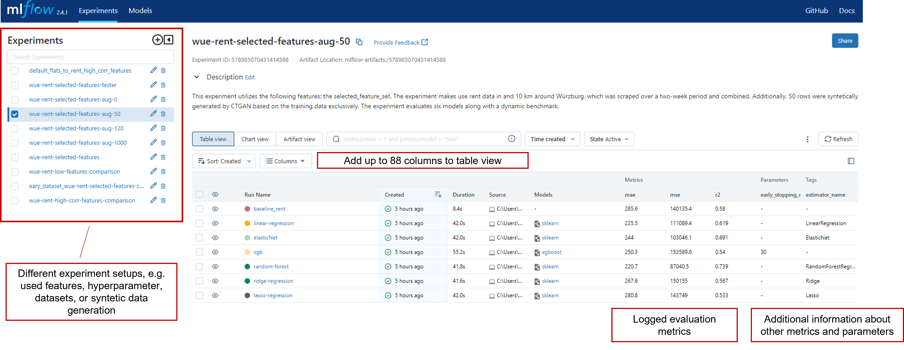

# Flat Price Assistant 


Accurate price predictions play a vital role when considering renting an apartment or purchasing a house in Würzburg. It is essential for tenants to determine if they are paying a reasonable amount, and for landlords to establish fair market prices based on the specific features of the property. To develop an ML system to enable this, we followed a structured process. First, a dataset was collected [data extraction & preprocessing](#data-extraction--preprocessing). Next, we performed [exploratory data analysis](#exploratory-data-analysis) and [feature engineering](#feature-engineering) to prepare the dataset for modelling. We then proceeded to train and compare different models and settings. The comparisons were documented and tracked using MLFlow (see [here](#modelling)). Once we selected the best model, we deployed it in the cloud for scalability and accessibility. The deployment process is described in [Architecture & Model Deployment](#architecture-and-model-deployment). Finally, we developed a [frontend](#frontend-application) application to provide an intuitive user interface for interacting with the ML system.

### Start our application
You just have to start our gradio frontend by executing the following command in the terminal, when the terminal is located in the `immowelt_price_guide/frontend` folder:
```
gradio app.py
```
Check the output of the console to retrieve the link. Since our backend is permanently deployed on [heroku]( https://flat-price-assistant-wue-9d5350c50d5c.herokuapp.com/docs) you can directly start querying on the UI without starting anything else.
## Data Extraction & Preprocessing

### Data Extraction
To create our dataset, we first scraped the current rental offers using [Apify](https://apify.com/). This involved extracting rental offers for flats from the website [immowelt](https://www.immowelt.de/). You can find our code, to scrap the data in this [folder](https://github.com/MichaelSeitz98/enterprise-ai-project/tree/main/immowelt_price_guide/scrape_and_preprocess). We extracted the raw data and stored it in an [Excel file](https://github.com/MichaelSeitz98/enterprise-ai-project/blob/main/immowelt_price_guide/data/flats_to_rent_wue_preprocessed_combined.xlsx).

### Exploratory Data Analysis
Exploratory data analysis was carried out using `ydata profiling` to gain insight into the distribution of the extracted dataset. The analysis focused on the dataset of dwelling rents and the results are publicly available via the following links. 

[EDA: basic dataset of flats to rent in Würzburg](https://michaelseitz98.github.io/enterprise-ai-project/eda-wue-rent-all.html)

The purpose of the exploratory data analysis was to gain an overview of the variables, identify missing values, assess class imbalance, and explore correlations among different variables. Statistical measures and visualizations were employed to understand the dataset's structure, uncover patterns, and identify potential issues. The analysis serves as a crucial step in the data exploration process, providing a foundation for informed decisions related to feature engineering and modeling. As the system can easily be adapted to the use case of predicting house purchase prices, we also extracted house data from Würzburg. A detailed insight into this can be seen [here](https://michaelseitz98.github.io/enterprise-ai-project/eda-wue-houses.html).

### Features Engineering

After the exploratory data analysis, we chose our final features to avoid overfitting. First, we looked at which features had a **high correlation** with the object feature. Then we looked at which features were **inbalanced**. For example, there is only one house with a bidet with a high price. Now the bidet is an indicator that only expensive houses have a bidet. So we remove this feature because only one apartment has it. We also looked at which feature the user can enter in our web application without any extra effort. The final features can retrieved from the [frontend_app](https://github.com/MichaelSeitz98/enterprise-ai-project/blob/main/immowelt_price_guide/frontend/app.py). 

### Preprocessing 

First we preprocessed all features that were **binary** with a binariser. For example, if an apartment has a specific feature such as a garden, the binariser sets the value of that feature to one. If the feature is not present in the apartment, it will get a zero as an indicator. In the next step we will precode all **categorical** features with a one-hot-encoder, because we do not have ordinary features. You can find the necessary steps we took to prepare our features in [train_and_eval_models.ipynb](https://github.com/MichaelSeitz98/enterprise-ai-project/blob/main/immowelt_price_guide/train_and_eval_models.ipynb) notebook  and [scrape_and_preprocess](https://github.com/MichaelSeitz98/enterprise-ai-project/tree/main/immowelt_price_guide/scrape_and_preprocess) folder. 
## Modelling

For this regression task, different models were trained, tuned and compared. The related code to the model  run can be be found in the notebook [train_and_eval_models.ipynb](https://github.com/MichaelSeitz98/enterprise-ai-project/blob/main/immowelt_price_guide/train_and_eval_models.ipynb) and [model_functions.py](https://github.com/MichaelSeitz98/enterprise-ai-project/blob/main/immowelt_price_guide/model_functions.py). To ensure reproducibility and comparability between models within different setups, model training was performed as a pipeline. For experimentation, such as finding suitable features, data set, data augmentation methods, model architecture, all runs are logged using MLFlow. 

- Linear regression 
- Lasso regression 
- Ridge regression 
- Elasticnet regression 
- Random Forest Regression 
- XGBoost Regressor
- Our own, dynamically updated benchmark

All these models are compared with a **benchmark model**. This benchmark model predicts prices using only the living space information (sqm) and the current average rent per square metre in Würzburg. The benchmark automatically scrapes the current price from [wohnungsboerse.net/mietspiegel-Wuerzburg](https://www.wohnungsboerse.net/mietspiegel-Wuerzburg/2772), where it is updated every month, so the benchmark is always up to date. Similarly, for a potential use case of buying a house, the dynamic benchmark uses the average purchase price per square metre in Würzburg, scraped from [wohnungsboerse.net/immobilienpreise-Würzburg](https://www.wohnungsboerse.net/immobilienpreise-Wuerzburg/2772).

### Training Pipeline

The models were trained using a standardized pipeline approach, ensuring consistent processing steps and comparability between them. A single function was designed to handle all the necessary steps, making it easy to train different models on various datasets. The pipelines takes `feature_set` as input, why we e.g. could compare the performance of models using different feature sets with one function execution. This streamlined approach allows for efficient model training and straightforward experimentation with different datasets and feature subsets.


### Logging & Evaluation of MLFlow

To facilitate model comparison and evaluation, each setup and training run with different combinations of features, models and hyperparameters was logged and tracked using `MLFlow`. This allowed for a comprehensive view of all relevant training runs, their evaluation metrics and the used parameters.

To access the model comparison results, follow these steps:

1. Navigate to the `immowelt_price_guide` directory.
2. Install MLFlow by running `pip install mlflow` or `pip install -r requirements.txt`.
3. Launch the MLFlow server using the command `mlflow server`.

Once the MLFlow server is running, you can access the results through a web interface. It provides an overview of all the tracked experiments and allows you to compare different models and their evaluation metrics. With MLFlow, you can easily identify and select the best-performing model for your specific use case, based on the analysis of various training runs.




When a model is selected for deployment on our production systems, it can be registered in the Model Registry`. This is a central repository for managing and versioning machine learning models. We used it to track and store different versions of our models for easy comparison and deployment. It has streamlined our model management process and enabled collaboration between team members. The model registry integrated seamlessly with our deployment pipeline, ensuring that the selected, latest models could be deployed to our Flat Price Assistant-WÜE application by setting the stage to "production" and loading them via API to the independently deployed backend, which is described more detailed at [Architecture and Deployment](#architecture-and-model-deployment). 


### Syntactic Data Generation

To extend our limited data set, we applied data augmentation techniques. We used a Generative Adversarial Network (GAN) specifically designed for tabular data, called `CTGAN`. This GAN can be trained on an existing dataset and generate new data instances with similar characteristics, effectively increasing the size of the dataset. To facilitate this process, we have developed a pipeline that integrates syntetic data generation with training and evaluation procedures. The implementation is available in the following Jupyter notebook: [train_and_eval_modules.ipynb](https://github.com/MichaelSeitz98/enterprise-ai-project/blob/main/immowelt_price_guide/train_and_eval_models.ipynb).

Note: the tabular GAN was exclusively trained using the training data. No information from the validation or test dataset was utilized for generating the augmented samples.
Although there is potential for data augmentation using `CTGAN`, our experiments clearly demonstrated that the mean absolute error (MAE) did not improve across any of the models. We generated additional rows ranging from 0 to 1000 for training purposes and evaluated their performance on "untouched" data. Obviously, the benchmark from MAE=286 (on the validation data) remained consistent in all experimental setups.
For this reason, data augmentation with CTGAN was not applied in the final system. 


### Hyperparameter tuning 

We performed a hyperparameter study for all models. The code for hyperparameter tuning  can be found in the `train_and_eval_models.ipynb` notebook. We used the optimization framework `Optuna` to determine the best parameters by performing a study using the validation data for each model. The `best_params` obtained from hyperparameter tuning were stored as JSON files in the [hyperparameter_tuned](https://github.com/MichaelSeitz98/enterprise-ai-project/blob/main/immowelt_price_guide/hyperparameter_tuned) folder. They can be used in the complete training pipeline (see `train_and_eval_models.ipynb`) by setting the input parameter `hpt=True`.

For each model, a study focused on finding the optimal hyperparameter. In particular, XGBoost, Random Forest (RF) and ElasticNet models, where there are more hyperparameters such as
* n_estimators
* learning rate 
* max_depth
* random state

 For linear, lasso and ridge regression, there are fewer parameters to optimize (e.g. only alpha and random state), so the continued hyperparameter tuning had little impact.
 
In the Optuna studies, we optimized the hyperparameters with respect to the Root Mean Squared Error (RMSE) of the validation data set. For this reason, the model performance for all models on the validation set clearly improved compared to no hyperparameter tuning. However, as there are very few data in the validation and test data sets, this does not necessarily translate into better performance on the test data set. In the tables below, for the example of RF and XGBoost, it can be seen that although the validation data set improved, the test performance did not improve. See all results of hyperparameter tuned runs on MLFlow server.  
Overfitting on the validation data set could be a reason, as well as the small amount of data in the test and validation sets.  With our concept of [continuous data scraping and retraining](#continuous-learning-retraining) this problem is tackled as the amount of data increases. For this reason, we decided to use the models without hyperparameter training, as the test results could not be improved.  


|    RF     | Hyperparameter Tuning | Without Hyperparameter Tuning | Benchmark |
| :-------: | :-------------------: | :---------------------------: | :-------: |
| RMSE_val  |       **275.6**       |             279.4             |   374.3   |
| RMSE_test |         182.6         |           **168.8**           |   304.1   |

|  XGBoost  | Hyperparameter Tuning | Without Hyperparameter Tuning | Benchmark |
| :-------: | :-------------------: | :---------------------------: | :-------: |
| RMSE_val  |       **256.9**       |             299.0             |   374.3   |
| RMSE_test |         196.6         |           **180.0**           |   304.1   |


### Final model evaluation 

Based on the metrics Mean Average Error (MAE), Root Mean Squared Error (RMSE), we chose the random forest as the preliminary first production model. This is the result of a run without data augmentation and with the default hyperparameters.

| Name          | mae_test | rmse_test | r2_test |
| ------------- | -------- | --------- | ------- |
| rf            | 138.3    | 168.8     | 0.903   |
| xgb           | 125.3    | 180.0     | 0.890   |
| elasticnet    | 188.4    | 232.8     | 0.816   |
| ridge         | 181.6    | 244.2     | 0.798   |
| lasso         | 188.0    | 254.5     | 0.780   |
| linear        | 184.8    | 270.2     | 0.752   |
| baseline-rent | 237.8    | 304.1     | 0.686   |


### Continuous Learning 

We implemented a dynamic learning pipeline where the training base can be updated with the latest scraped data from Würzburg. The complete retraining pipeline is also developed in the `train_and_eval.ipynb` notebook and schematically follows the process shown.

 

The newly trained models are evaluated on the same validation as before, so it is clear whether the new data has improved the model or not. This method is also useful for extending the dataset over time, as the dataset is continuously extended. To do this, we build an administration page where information about the current production model can be viewed, and a complete retraining with newly scraped data can be performed. The whole process is demonstrated in detail as video in [Admin Frontend](#admin-frontend).


## Frontend Application
### User Frontend
We use `Gradio` as our frontend framework. `Gradio` is particularly good at applying models. To be able to predict a property price, we need a dataset that has the same requirements as our training, validation and test dataset. Therefore, the user has to enter his property characteristics in the front end. The next step is to generate the dataframe from this. After this step, we load our state of the art model to predict the rental price for the user. Here you can watch a video how our [frontend](https://www.youtube.com/watch?v=4TPxXEXrMQA) is working.


### Admin Frontend
In this front-end application, the administrators of our website can scrap new data and automatically retrain the machine learning models. First the admin has to select which models to retrain. Then the user can click the button. Now the latest flat data from Würzburg is scraped from Immowelt and combined with the existing training data set.The models are then retrained with the updated and expanded training data. When the retraining process is complete, we can decide which models have improved and which model is now the best model for predicting prices. This application is separate from our user front-end, it's just for us to retrain and visualize the performance of our models.

**Link to demo video:**

[](https://youtu.be/gJpT2Nffe3M)


# Architecture and Model Deployment

This technical documentation provides an overview of the architecture and model deployment process for our ML application. The application leverages MLFlow for model training, management, and versioning, while the frontend is built using `Gradio`. The backend application is developed with FastAPI and hosted on Heroku, allowing for easy deployment of new models to the cloud.

## Architecture Overview


The architecture of our ML application can be described as follows:

1. **MLFlow**: MLFlow is used for model training, tracking, and versioning. It runs on a local server, and all artifacts are stored in our repository. This enables every team member with access to the repository to create models, train them, and store different versions as well as setting them in production stage.

2. **Frontend (Gradio)**: The frontend of our application is built using Gradio. It collects the necessary data for the model to create predictions. Once the data is collected, the Gradio app sends a POST request to our FastAPI backend application. The gradio can be started locally and shared on a temporary public URL. In the future, it would be no problem and good practice to host the frontend on a cloud server on heroku as well. But therefore we should separate it a dedicated repository and container - what would have exeeded our students offer limit on heroku. 

3. **Backend (FastAPI)**: The FastAPI backend application provides various endpoints.. When a request is received at the `/predict` endpoint, the desired model is loaded and ready to make predictions. The dedicted folder is located under `/immowelt_price_guide/backend`. [Also find here](https://github.com/MichaelSeitz98/enterprise-ai-project/tree/main/immowelt_price_guide/backend). 

The `main.py` includes the FastAPI app and the following endpoints:
   -  `/predict` endpoint: This endpoint is used to make predictions. It receives a POST request from the frontend application, loads the desired model, and returns the prediction.
   - `/model-info` endpoint: This endpoint is used to retrieve information about the model. It receives a GET request from the frontend application and returns the model's input and output parameters as well as the name and some infos about the version. 
   - `/` root: This endpoint is used to check the health of the application. It receives a GET request from the frontend application and returns a status code of 200 if the application is running.


4. **Cloud Deployment (Heroku)**: The backend application is hosted on Heroku, making the endpoint permanently publicly available for everyone. The frontend and backend are designed to run independently of each other.

Find hosted available api documentation here: [https://flat-price-assistant-wue-9d5350c50d5c.herokuapp.com/docs](https://flat-price-assistant-wue-9d5350c50d5c.herokuapp.com/docs).

## Model Deployment Process

Deploying a new model to the cloud follows the following steps:

1. Set the new model in production using MLFlow. This ensures that the model is available and can be accessed by name.

2. Prepare the deployment cell: We have a preconfigured cell that performs the necessary steps for deployment. By simply setting a new name, the following actions are automated:

   1. Load the model by its name from the MLFlow server.
   2. Gather all the necessary information about the model, including input and output parameters, required Python version, and the required packages with their specific versions.
   3. Set the model, its details, and requirements to the backend folder of our repository. This folder serves as the foundation for the deployed model in the cloud.

3. Commit the changes to the main branch of our repository. Since Heroku is set up with our Git repository, pushing the changes triggers a new deployment on the cloud. The command `git push heroku main` is used for this purpose.

4. Heroku deployment: The deployment process is possible because we have a `heroku.yml` file placed in our root directory, which directs to the Dockerfile located in our backend folder. The Dockerfile defines the image to be built for the model in production. Once the container is built, it runs on the Heroku cloud.

By following these steps, a new model can be easily deployed to the cloud, ensuring that the latest version is available for use as well as all the required dependencies. This makes sure to not run into version or dependency issues when deploying a new model.
## Outlook & Discussion

* **Explainable Predictions**
  In order to provide transparent predictions and help users understand how predicted prices are calculated, we can integrate explainable AI techniques into the user interface. One such technique is using `SHAP` values to display the importance of different features and their impact on the predicted price. We  created example `SHAP Waterfall` plots for XGB, how users could visualize how various input values contribute to the prediction. The next step is to integrate these plots into the user frontend, allowing users to have transparent insights into their individual price predictions.
  


* **Continuous data enrichment**
 In order to offer our clients a broader range of forecasts, we should also include data from other cities and for different property types. Analysing rental prices in different regions allows us to take into account regional differences and market characteristics. By including different types of property, such as houses, we can provide a more comprehensive view of the rental market. In addition, we can use the data from other cities and property types to train our models and improve their performance.
  The rental market is dynamic and subject to constant change. It is therefore essential that we include a timestamp in our data to record when the data was collected.

* **Build our own scraper** 
  We used a scraper from [Apify](https://apify.com/bibim/immowelt-scraper) to get our data. In the future we want to build our own scraper to get more data and to be more flexible. We want to be able to get data from different websites and not just from immowelt.de. This will allow us to get more data and to be more flexible in the future. Another advantage of a self-developed scraper is the possibility to reduce costs in the long run. If we wanted to expand our model to other cities or regions, the costs of using a paid scraper would increase with each additional location. By developing a customized scraper in-house, we could minimize these expenses and respond flexibly to new demands.


