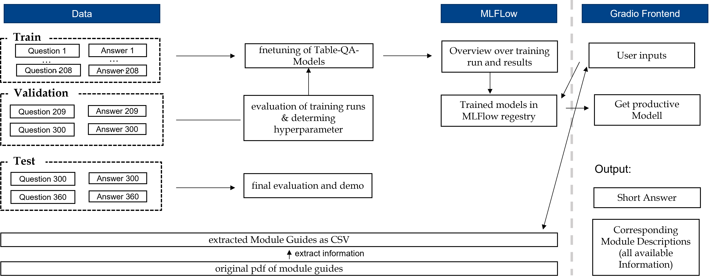

# University Module Guide Assistant

This technical documentation outlines our approach to building a "University Module Guide" using Python 3. Although the approach did not yield the desired results, it is important to document the process for future reference. The main steps involved extracting module catalogues in PDF format, preprocessing the data, and attempting to utilize the Google TAPAS algorithm for question-answering capabilities.

## Approach Overview

1. PDF Extraction: We used the `pdfminer.six` library to extract text from the module catalogues in PDF format. This allowed us to obtain the raw module information for further processing.
3. Chatbot Development: Our objective was to create a chatbot capable of answering questions about the modules. We planned to utilize the Google TAPAS algorithm for this purpose, which required a large training set of questions and answers. 

4. Training Set Preparation: We aimed to create a comprehensive training set by generating a set of prepared questions and corresponding answers. This set would serve as the training data for the Google TAPAS model. Data, some code and approaches can be found within [module_guide_tableQA/04_finetuning_approaches](https://github.com/MichaelSeitz98/enterprise-ai-project/tree/main/module_guide_tableQA/04_finetuning_approaches).

5. Google TAPAS Training: We intended to train the `google-tapas-base` model using the prepared training set. The TAPAS model is specifically designed for question-answering on tabular data. We tried to orientate our idea on [this public example](https://colab.research.google.com/github/NielsRogge/Transformers-Tutorials/blob/master/TAPAS/Fine_tuning_TapasForQuestionAnswering_on_SQA.ipynb#scrollTo=t5iU5byAICWb).

# Idea 

## Challenges Encountered

During the implementation of our approach, we encountered several challenges that ultimately led to the inability to achieve the desired outcome. These challenges include:

1. Insufficient GPU Power: Training the Google TAPAS model requires a significant amount of GPU power due to the complexity of the underlying neural network architecture. Unfortunately, we did not possess the necessary GPU resources to train the model effectively.

2. Limitations with Large Tables: The Google TAPAS algorithm performs well with small tables. Throughout our research and implementation process, we encountered a scarcity of matching examples or successfully built ideas specifically tailored for larger tables online. Most available resources and documentation primarily focused on small tables, typically containing up to approximately 20 rows. However, we encountered difficulties when attempting to use a large table with approximately 200-300 rows. The algorithm struggled to handle this scale of data efficiently.

3. Resource Constraints: Despite our best efforts, we faced limitations that hindered our ability to effectively train the TAPAS model. These constraints impacted the performance and feasibility of our approach.

## Frontend Application Demonstration

But nevertheless, we developed a frontend application using Hugging Face's model hosting service (huggingface.io) to demonstrate the functionality of our approach for a smaller set of modules. This application allows users to interact with the chatbot and ask questions about some modules within our Information Systems Master.

Find it here [Module Guide Assistant](https://huggingface.co/spaces/Supermichi100/module-guide-assistant).

The frontend application showcases the potential of the approach by utilizing a reduced set of modules (approximately 15 modules) that is more manageable and well-suited for the capabilities of the Google TAPAS algorithm.

## Conclusion

In conclusion, our attempt to build a "University Module Guide" using Python 3, PDF extraction, data preprocessing, and the Google TAPAS algorithm was not entirely successful. The challenges we faced, such as insufficient GPU power and limitations with large tables, hampered our progress and prevented us from achieving the desired outcome.

It is important to acknowledge that the approach we pursued was ambitious and required significant computational resources. Given our limitations, we recommend exploring alternative methods or utilizing cloud-based solutions with ample GPU power to overcome the challenges we faced.

While this particular approach did not yield the desired results, documenting the process serves as a valuable learning experience and provides insights for future endeavors in similar domains.