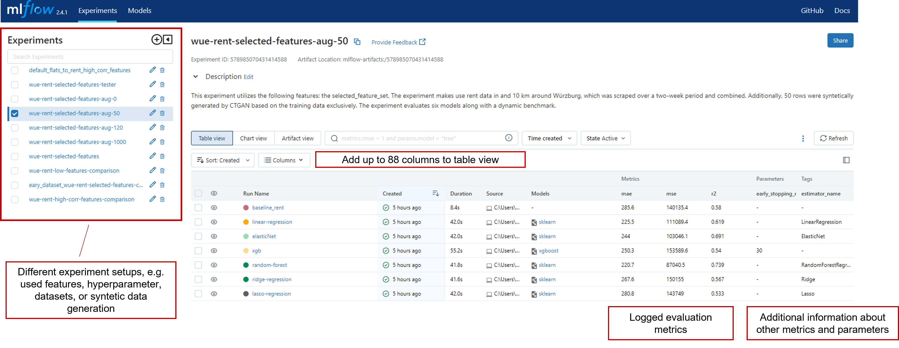
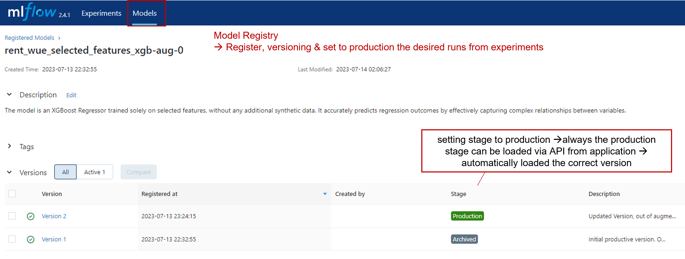
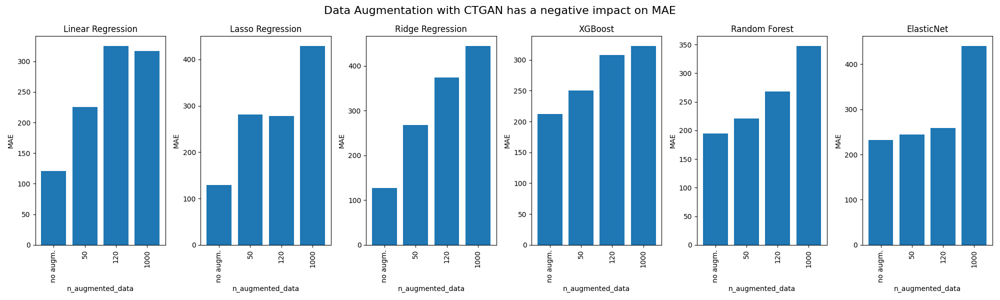

# Price Recommendation Tool

Accurate price predictions for flat rents and house buys in Würzburg are crucial. They enable informed decision making, aid budget planning, support market analysis, ensure fair transactions, and reduce information asymmetry. Price predictions play a crucial role in facilitating well-informed choices and efficient transactions in Würzburg's real estate market.

To develop an ML system to enable this, we followed a structured process.  First, we scraped our own dataset by utilizing web scraping techniques. The details of the data extraction process can be found under the [data extraction](#data-extraction) section. Next, we conducted [exploratory data analysis](#exploratory-data-analysis) and performed [feature engineering](#feature-engineering) to prepare the dataset for modeling. We then proceeded to train and compare different models using the dataset. The [training](#model-training-and-evaluation) procemodel comparisons were documented and tracked using MLFlow. Once we selected the best model, we deployed it to the cloud for scalability and accessibility. The deployment process is described under [deployment to cloud](#deployment-to-cloud). Finally, we developed a [frontend](#frontend-application) application to provide an intuitive user interface for interacting with the ML system.

## Data Extraction 

## Exploratory Data Analysis
An exploratory data analysis was conducted using `ydata-profiling` to generate insights about the distribution of the extracted dataset. The analysis focused on the flat rent data set, and the results can be accessed publically via the following links. 

* [EDA: basic dataset of flats to rent in Würzburg](https://michaelseitz98.github.io/enterprise-ai-project/eda-wue-rent-all.html)

The purpose of the exploratory data analysis was to gain an overview of the variables, identify missing values, assess class imbalance, and explore correlations among different variables. Statistical measures and visualizations were employed to understand the dataset's structure, uncover patterns, and identify potential issues. The analysis serves as a crucial step in the data exploration process, providing a foundation for informed decisions related to feature engineering and modeling. As the system can easily be adapted to the use case of predicting house purchase prices, we also extracted house data from Würzburg. A detailed insight into this can be seen [here](https://michaelseitz98.github.io/enterprise-ai-project/eda-wue-houses.html).

## Model Training and Evaluation

For this regression task, different models were trained, tuned and compared. All training and model related code can be found in the notebook `train_and_eval_models.ipynb`. To ensure reproducibility and comparability between models, model training was performed as a pipeline. For experimentation, such as finding suitable features, data set, data augmentation methods, model architecture, all runs are logged using MLFlow. 

- Linear regression 
- Lasso regression 
- Ridge regression 
- Elasticnet regression 
- Random Forest Regression 
- XGBoost Regressor
- Our own (dynamically updated) Benchmark

All of these models are benchmarked against our own simple **benchmark model**. This baseline model predicts prices using only the living room information and the current average rental/purchase price per square metre in Würzburg. The benchmark automatically scrapes the current price from [wohnungsboerse.net/mietspiegel-Wuerzburg](https://www.wohnungsboerse.net/mietspiegel-Wuerzburg/2772), where it is updated every month. So the benchmark is always up to date. In the same way, for our 2nd use case, buying a house, we also have a dynamic benchmark, but with the average purchase price per square metre. This is also automatically taken from [wohnungsboerse.net/immobilienpreise-Wuerzburg](https://www.wohnungsboerse.net/immobilienpreise-Wuerzburg/2772). This benchmark gets updated at least once a month. 

### Logging and Storing via MLFlow {.no-toc}

Every different set-up of used features, used models and differently used hyperparameter was logged and compared to each other via `MLFlow`. All different runs aka experiment where tracked and evaluated there, see like a example model comparison. So, the best suitable model could be chose.  

If a model is chosen to be deployed for our productive systems, it can be registered to `model registry`. This s a centralized repository for managing and versioning machine learning models. We utilized it to track and store different versions of our models, enabling easy comparison and deployment. It streamlined our model management process and enables collaboration amongteam members . The Model Registry integrated seamlessly with our deployment pipeline, ensuring that the selected models can be deployed to our "Würzburger Mietpreis-Checker" application, by setting the stage to "production" and load it via API from the application. This allowed us to easily incorporate the latest models into our production application for rent price analysis in Würzburg.

### Data Augmentation {.no-toc}

To expand our limited dataset, we employed data augmentation techniques. We utilized a Generative Adversarial Network (GAN) specifically designed for tabular data called `CTGAN`. This GAN can be trained on an existing dataset and generate new data instances that possess similar characteristics, effectively increasing the size of the dataset. 
To facilitate this process, we developed a comprehensive pipeline that integrates the training and evaluation procedures with augmented data. The implementation is available in the following Jupyter Notebook: [train_and_eval_modules.ipynb](https://github.com/MichaelSeitz98/enterprise-ai-project/blob/main/immowelt_price_guide/train_and_eval_models.ipynb).

Please note that the tabular GAN was exclusively trained using the training data. No information from the validation or test dataset was utilized for generating the augmented samples.
Although there is potential for data augmentation using CTGAN, our experiments clearly demonstrated that the mean absolute error (MAE) did not improve across any of the models. We generated additional rows ranging from 0 to 1000 for training purposes and evaluated their performance on "untouched" data. Obviously, the benchmark from 286 remained consistent in all experimental setups. For this reason, data augementation with CTGAN was not applied in the final system. 

### Continous Learning Pipeline 

We implemented a dynamic learning pipeline, where the training base can be extended with the newest scraped data.

## Frontend Application
We use Gradio as our front-end framework. `Gradio` is particularly good at applying models. To be able to predict a property price, we need a dataset that has the same requirements as our training, validation and test dataset. Therefore, the user has to enter his property characteristics in the front end. The next step is to generate the dataframe from this. After this step, we load our state of the art model to predict the property price for the user. 

## Deployment to Cloud

## Outlook & Discussion

* extend data set data, regualary scraped. every week new scarping 
